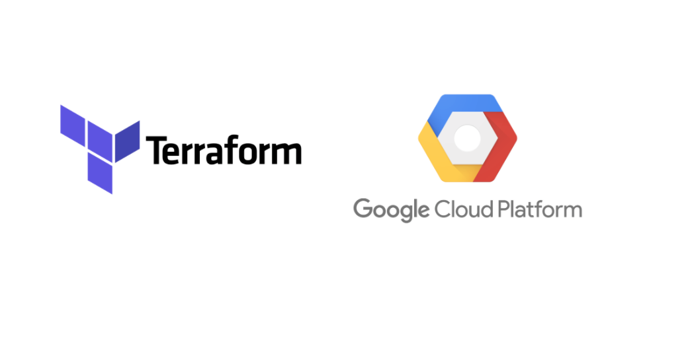

# GCP-Terraform-App-Deployment

---



---

## Deployment of a simple python application on Google Cloud Run using Terraform.

Terraform is an open-source infrastructure as code (IaC) tool developed by HashiCorp. It’s designed to help users define, provision, and manage infrastructure resources and services in a declarative and efficient manner. Terraform enables version control, collaboration, and documentation of infrastructure changes, making it easier to track and manage infrastructure configurations over time.

It supports multiple cloud providers and can manage resources across different cloud environments and on-premises infrastructure, promoting flexibility and avoiding vendor lock-in. By automating the provisioning and configuring of infrastructure, Terraform reduces the risk of manual errors and ensures that environments are consistent and reproducible. Terraform can manage both small-scale and large-scale infrastructures, making it suitable for projects of varying sizes and complexities.

In this project, we're creating a simple infrastructure on GCP, including a state bucket, clusters, and nodes. You’ll also push a Docker image to the Artifact Registry and will deploy a simple application on Google Cloud Run using Terraform. To achieve this, you’ll write scripts in Terraform files that are already created for you as .tf files in the /usercode directory of this project. For your ease, the application to be deployed on Cloud Run is also available in the /usercode/Application directory. To complete this project, you’ll execute the commands in the terminal, where all the utilities are already installed.

To run the application:

```bash
cd /usercode/Application
python3 manage.py runserver 0.0.0.0:8080
```

You can stop the server by pressing `Ctrl + C`

---

### Prepare Docker image

Prepare a Docker image for the web application that will be deployed on Cloud Run by the end of this project:

1. Log in to your Docker Hub using the CLI command.
2. Build the Docker image using the Dockerfile file available in the /usercode/application/ directory.
3. Push the image to your Docker Hub repository.

```bash
docker login -u <your username> 
cd /usercode/Application
docker build -t <your repository name>/<desired image name>:<desired tag> . 
docker push <your repository name>/<desired image name>:<desired tag> 
```

